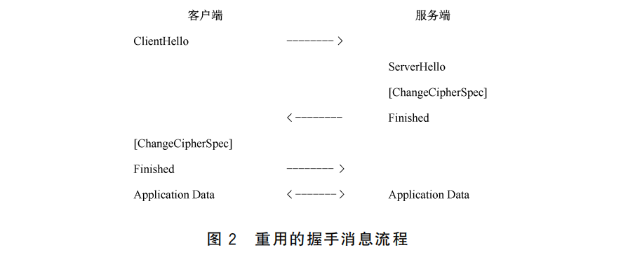

# 关于 TLCP

> 该部分内容大部分出自 GB/T 38636-2020

## 1. 协议介绍

传输层密码协议 **T**ransport **L**ayer **C**ryptography **P**rotocol (TLCP) 

TLCP协议采用SM系列密码算法和数字证书等密码技术保障传输层的机密性、完整性、身份认证和抗攻击。

TLCP协议被定义于《GB/T 38636-2020 信息安全技术 传输层密码协议》，于2020年4月发布，在2020年11月实施。

在此之前TLCP的前身 SSL（国密）虚拟私有网络已经在行业使用多年，这里就需要提及《GM/T 0024-2014》也就是GMSSL（基于国密算法的SSL），以下简称 **GMSSL**。

《GM/T 0024-2014》 的协议内容参照传输层安全协议(RFC4346 TLS1.1)，在TLS1.1的握手协议中增加了ECC、IBC的认证模式
和密钥交换模式，取消了DH密钥交换方式，修改了密码套件的定义。另外，在本标准中还增加了网关-网关协议。 ——《GM/T 0024-2014》 引言

| 对比项 | GM/T 0024-2014（GMSSL） | GB/T 38636-2020（TLCP）|
| :-- | :-- | :-- |
| 区别 | 密码行标 | 国标 |
| 用途 | 主要用于SSL 虚拟私有网络产品的研制，也可以指导SSL虚拟私有网络产品的监测、管理和使用。 | 适用于传输层密码协议相关产品（如SSL虚拟私有网络网关、浏览器等）的研制，也可以用于指导传输层密码协议相关产品的监测、管理和使用。 |
| 算法 | 支持国密SM1、SM2、SM3、SM4、SM9，对称加密加密模式仅支持CBC模式 | 支持国密SM2、SM3、SM4、SM9，对称加密加密模式仅支持GCM、CBC模式 |
| 协议 | 记录层协议、握手协议族、密钥计算、网关-网关协议 | 记录层协议、握手协议族、密钥计算 |

## 2. 协议流程概述

握手协议涉及以下过程:

- 交换hello消息来协商密码套件，交换随机数，决定是否会话重用。
- 交换必要的参数，协商预主密钥。
- 交换证书或IBC信息，用于验证对方。
- 使用预主密钥和交换的随机数生成主密钥。
- 向记录层提供安全参数。
- 验证双方计算的安全参数的一致性、握手过程的真实性和完整性。

### 2.1 握手过程

握手过程如下：

客户端发送客户端hello 消息给服务端，服务端应回应服务端hello 消息，否则产生一个致命错误并且断开连接。客户端hello和服务端hello用于在客户端和服务端进行基于SM2、RSA或IBC的密码算法协商，以及确定安全传输能力，包括协议版本、会话标识、密码套件等属性，并且产生和交换随机数。

在客户端hello和服务端hello消息之后是身份验证和密钥交换过程。包括服务端证书、服务端密钥交换，客户端证书、客户端密钥交换。

在服务端发送完hello消息之后，接着发送自己的证书消息，服务端密钥交换消息。如果服务端需要验证客户端的身份，则向客户端发送证书请求消息。然后发送服务端hello完成消息，表示hello 消息阶段已经结束，服务端等待客户端的返回消息。如果服务端发送了一个证书请求消息，客户端应返回一个证书消息。然后客户端发送密钥交换消息，消息内容取决于客户端hello消息和服务端hello 消息协商出的密钥交换算法。如果客户端发送了证书消息，那么也应发送一个带数字签名的证书验证消息供服务端验证客户端的身份。

接着客户端发送密码规格变更消息，然后客户端立即使用刚协商的算法和密钥，加密并发送握手结束消息。服务端则回应密码规格变更消息，使用刚协商的算法和密钥，加密并发送握手结束消息。至此。握手过程结束，服务端和客户端可以开始数据安全传输。

### 2.2 重用握手

如果客户端和服务端决定重用之前的会话，可不必重新协商安全参数。客户端发送客户端hello消息，并且带上要重用的会话标识。如果服务端有匹配的会话存在，服务端则使用相应的会话状态接受连接，发送一个具有相同会话标识的服务端hello消息。然后客户端和服务端各自发送密码规格变更消息和握手结束消息。至此握手过程结束，服务端和客户端可以开始数据安全传输。如果服务端没有匹配的会话标识，服务端会生成一个新的会话标识进行一个完整的握手过程。

## 3. TLCP密码套件

GB/T 38636-2020 6.4.5.2.1 定义了目前TLCP协议支持所有密码套件如下所示：

| 名称                 | 密钥交换  | 加密     | 效验   | 值           |
|--------------------|-------| ------- | ------ |-------------|
| ECDHE_SM4_CBC_SM3  | ECDHE | SM4_CBC | SM3    | {0xe0,0x11} |
| ECDHE_SM4_GCM_SM3  | ECDHE | SM4_GCM | SM3    | {0xe0,0x51} |
| ECC_SM4_CBC_SM3    | ECC   | SM4_CBC | SM3    | {0xe0,0x13} |
| ECC_SM4_GCM_SM3    | ECC   | SM4_GCM | SM3    | {0xe0,0x53} |
| IBSDH_SM4_CBC_SM3  | IBSDH | SM4_CBC | SM3    | {0xe0,0x15} |
| IBSDH_SM4_GCM_SM3  | IBSDH | SM4_GCM | SM3    | {0xe0,0x55} |
| IBC_SM4_CBC_SM3    | IBC   | SM4_CBC | SM3    | {0xe0,0x17} |
| IBC_SM4_GCM_SM3    | IBC   | SM4_GCM | SM3    | {0xe0,0x57} |
| RSA_SM4_CBC_SM3    | RSA   | SM4_CBC | SM3    | {0xe0,0x19} |
| RSA_SM4_GCM_SM3    | RSA   | SM4_GCM | SM3    | {0xe0,0x59} |
| RSA_SM4_CBC_SHA256 | RSA   | SM4_CBC | SHA256 | {0xe0,0x1c} |
| RSA_SM4_GCM_SHA256 | RSA   | SM4_GCM | SHA256 | {0xe0,0x5a} |

**GB/T 38636-2020：本标准实现ECC和ECDHE的算法为SM2；实现IBC和IBSDH的算法为SM9。**

密码套件名称说明： `密钥交换协议_对称加密算法_对称加密模式_完整性校验算法`。

密钥交换协议概述：

**ECDHE**: 

- 工作模式为双向身份认证
- 基于SM2密钥交换协议详见GT/T GBT 35276-2017 9.6
- 要求该协议需要服务端具有签名密钥、签名证书、加密密钥、加密证书。
- 要求客户端具有身份认证密钥、认证证书。
- 密钥交换协议：
  - 通信双方需要相互交换数字证书。
  - 通双方需要相互交换EC临时公钥。
  - 根据GT/T GBT 35276-2017 9.6 计算共享密钥，作为预主密钥。
- 特别的服务端密钥交换使用 **加密密钥对**，签名密钥对仅作为验证使用。

**SM2**：

- 工作模式支持：单向身份认证、双向身份认证，取决于服务端配置。
- 要求该协议需要服务端具有签名密钥、签名证书、加密密钥、加密证书。
- 密钥交换协议：
  - 客户端生成预主密钥。
  - 客户端通过服务端加密证书的公钥加密预主密钥，发送给服务端。
  - 服务端通过加密密钥私钥解密得到预主密钥。
- 在双向身份认证模式下：
  - 要求客户端具有身份认证密钥、认证证书。
  - 客户端发送客户端证书。
  - 客户端使用认证密钥对签名生成证书认证消息。
  - 服务端验证客户端证书以及签名值。
