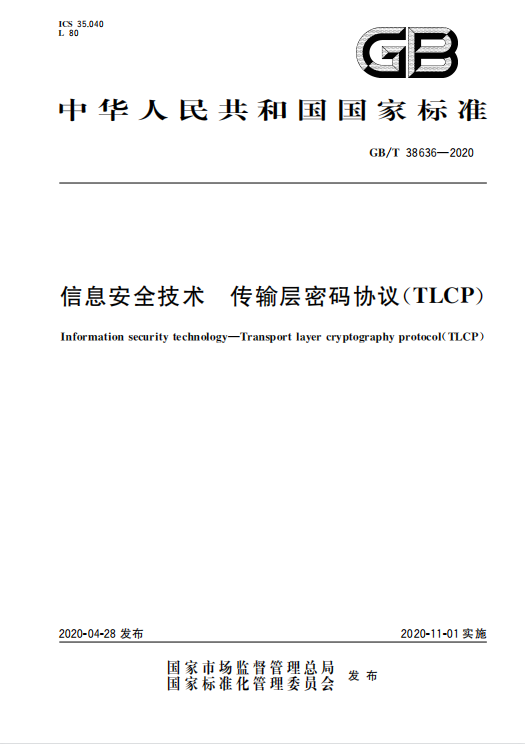
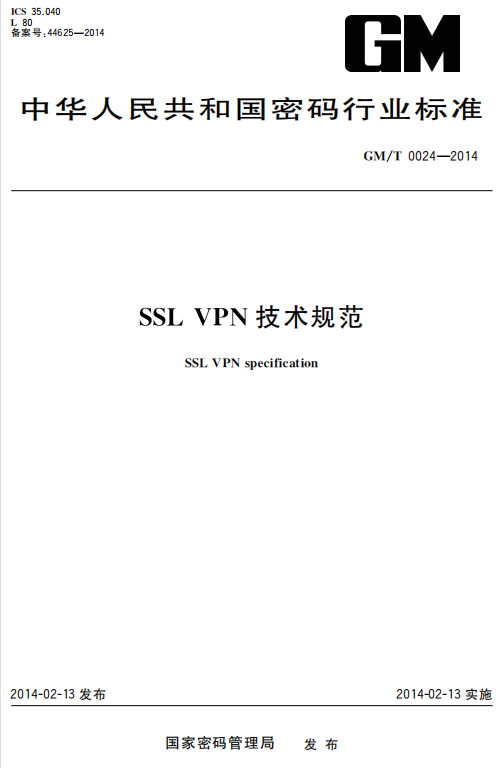

# 关于 TLCP

传输层密码协议 **T**ransport **L**ayer **C**ryptography **P**rotocol (TLCP) 

TLCP协议采用SM系列密码算法和数字证书等密码技术保障传输层的机密性、完整性、身份认证和抗攻击。

TLCP协议被定义于《GB/T 38636-2020 信息安全技术 传输层密码协议》，于2020年4月发布，在2020年11月实施。

在此之前TLCP的前身 SSL VPN（国密）早已经在密码行业使用多年，这里就需要提及《GM/T 0024-2014 SSL VPN技术规范》，也就是
也就是GMSSL（国产密码算法的SSL），以下简称 **GMSSL**。

《GM/T 0024-2014》 的协议内容参照传输层安全协议(RFC4346 TLS1.1)，在TLS1.1的握手协议中增加了ECC、IBC的认证模式
和密钥交换模式，取消了DH密钥交换方式，修改了密码套件的定义。另外，在本标准中还增加了网关-网关协议。 ——《GM/T 0024-2014》 引言

| 对比项 | GM/T 0024-2014（GMSSL） | GB/T 38636-2020（TLCP）|
| :-- | :-- | :-- |
| 区别 | 密码行业标准 | 国家标准 |
| 用途 | 主要用于SSL VPN产品的研制，也可以指导SSL VPN产品的监测、管理和使用。 | 适用于传输层密码协议相关产品（如SSL VPN网关、浏览器等）的研制，也可以用于指导传输层密码协议相关产品的监测、管理和使用。 |
| 算法 | 支持国密SM1、SM2、SM3、SM4、SM9，对称加密加密模式仅支持CBC模式 | 支持国密SM1、SM2、SM3、SM4、SM9，对称加密加密模式仅支持GCM、CBC模式 |
| 协议 | 记录层协议、握手协议族、密钥计算、网关-网关协议 | 记录层协议、握手协议族、密钥计算 |
