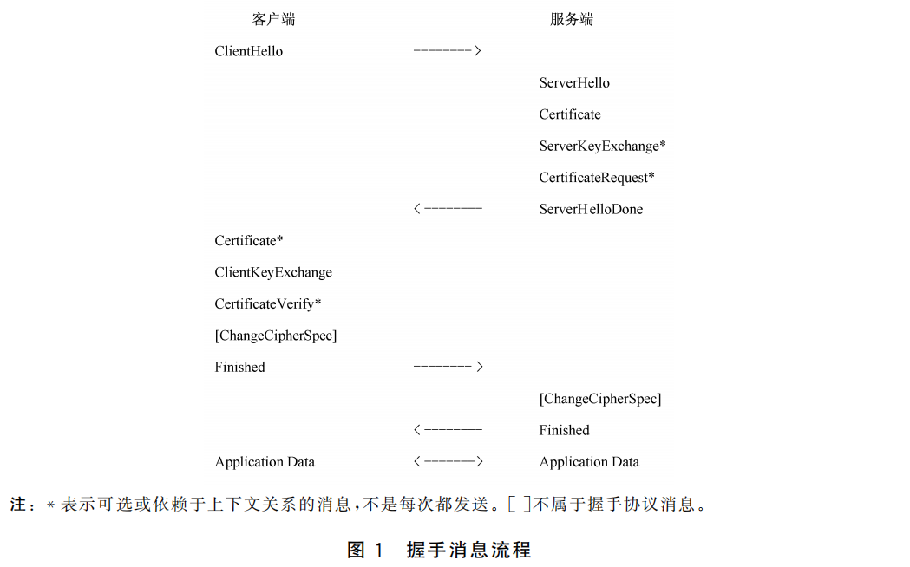

# GoTLCP 数字证书及密钥

注：TLCP协议中出IBC参数外，所有数字证书格式均要求为 X.509格式，数字证书格式参见 《GMT 0015-2012 基于SM2密码算法的数字证书格式》，其中服务端证书为“服务器证书”。

## 1. TLCP协议的证书和密钥

TLCP协议以CS（Client and Server）的架构实现通信：

- 连接的发起方称为**客户端**（client）
- 接受连接的一方称为**服务端**（server）





###  1.1 服务端密钥 及 客户端根证书

区别于TLS协议，TLCP协议要求服务端需要使用2对非对称密钥对以及2张证书，它们分别是：

- 签名密钥对、签名证书，用于身份认证。
- 加密密钥对、加密证书，用于密钥交换，特别的加密密钥对应由外部密钥管理机构（KMC）产生并由外部认证机构签发加密证书。（见 GM/T 0024 7.3.1.1.1）

我们将签名密钥对与加密密钥对统称为 **服务端密钥** 。


数字证书要求：

- 签名证书要求密钥用法具有 **数字签名（Digital Signature）、防抵赖（Non-Repudiation）**，扩展密钥用法要求具有 **服务器身份验证(`1.3.6.1.5.5.7.3.1`)**
- 加密证书要求密钥用法具有 **数据加密（Data Encipherment）**


**若服务端开启了对客户端的身份认证**，那么此时客户端将会传输它的认证证书以及认证密钥的签名值供服务端验证（详见 GB/T 38636 6.4.4 握手协议总览），为了有效验证客户端证书的有效性，**服务端需要预先导入客户端的根证书列表**，否则无法验证客户端证书有效导致握手终止。

### 1.2 客户端密钥 及 服务端根证书

根据服务端对客户端认证要求的不同，客户端在握手流程具有不同表现，目前服务端对客户端认证方式支持：

- **不需要认证**，服务端不需要认证客户端身份**不需要客户端密钥**。
- **要求客户端身份认证**，该方式下需要客户端必须**拥有客户端密钥**。

若服务端开启了握手**要求客户端身份认证**，那么客户端必须具有客户端密钥，并且在握手过程中将会发送**客户端证书消息（Client Certificate）**、**客户端证书验证消息（Certificate Verify）**

为了与服务端的签名证书与签名密钥对区别，通常使用客户端**认证密钥对、认证证书** 来称呼客户端签名密钥对及证书。

按照握手协议在服务端发送了服务端的证书列表（两张证书，签名证书、加密证书），那么客户端应验证分别两张证书的有效性，因此**客户端需要预先导入服务端根证书列表**，否则无法验证服务端证书有效导致握手终止。


数字证书要求：

- 认证证书要求密钥用法具有 **数字签名（Digital Signature）、防抵赖（Non-Repudiation）**，扩展密钥用法要求具有 **客户端身份验证(`1.3.6.1.5.5.7.3.2`)**


> 注：TLCP协议区别TLS协议，TLCP协议的服务端证书消息中为2张证书，按顺序分别为签名证书、加密证书。

## 2. Go TLCP证书及密钥

目前Go TLCP通过`emmansun/gmsm`的`smx.509`模块，目前数字证书解析支持数字证书的PEM格式，您可以通过下面这个方式解析证书：
````go
rootCert, err := smx509.ParseCertificatePEM([]byte(ROOT_PEM))
if err != nil {
    panic(err)
}
````

- ROOT_PEM：x.509 ASN1.1 DER编码的PEM格式字符串。


GoTLCP修改自golang `1.19`的`crypto/tls`，采用了`tlcp.Certificate`的对象作为证书和密钥证书密钥对，`tlcp.Certificate`结构下：

```go
package tlcp

// 数字证书及密钥对
type Certificate struct {
	Certificate [][]byte          // 数字证书DER二进制编码数组
	PrivateKey crypto.PrivateKey  // 密钥对接口
	Leaf *smx509.Certificate        // X509证书对象缓存
}
```


关于密钥目前GoTLCP模块，支持对PKCS#8格式的SM2密钥解析，您可以按照下面方式解析密钥对及证书：

```go
keycert, err := LoadX509KeyPair(certFile, keyFile)
if err != nil {
    panic(err)
}
```


